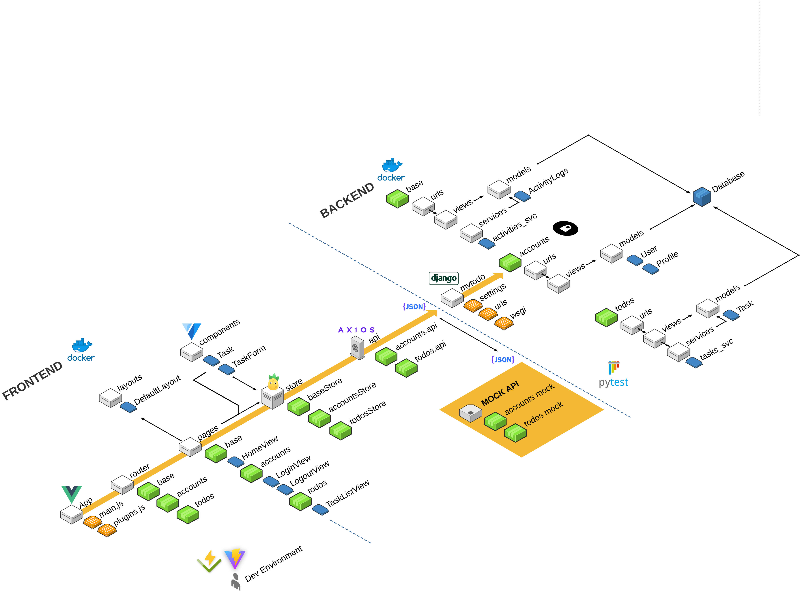
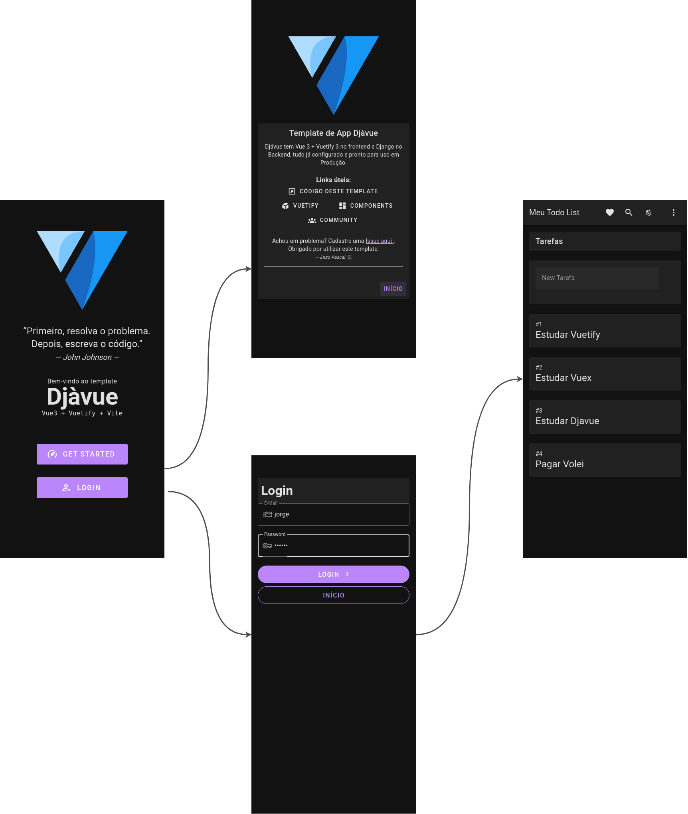
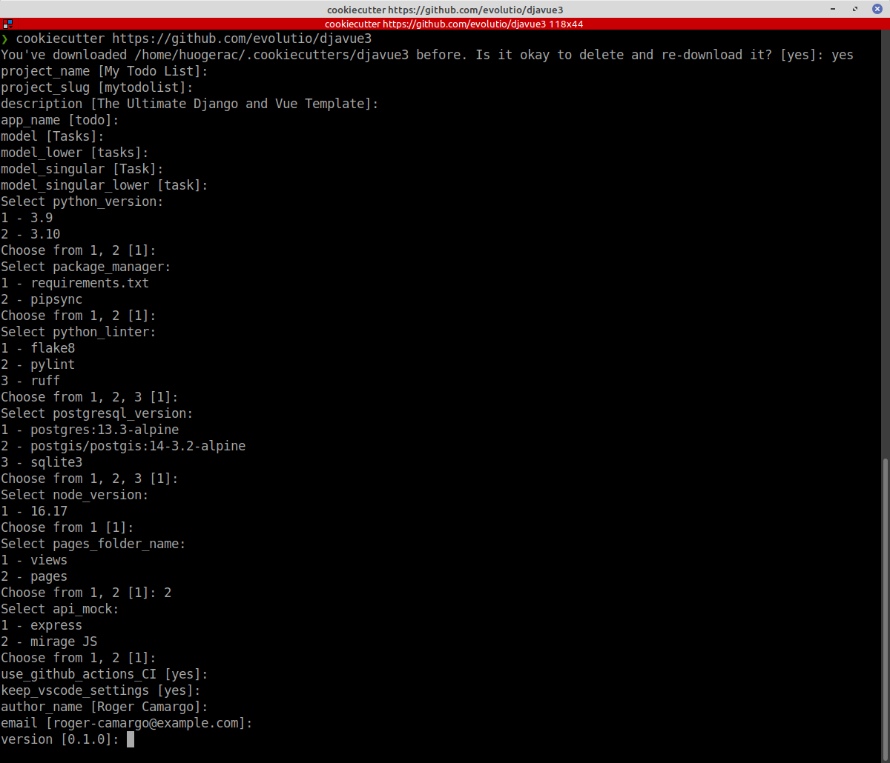

# D-jà vue

Um 📦template de projeto completo **full-stack**, **pronto para produção**, com boas práticas e focado na produtividade. Combina um frontend moderno (Vue 3 | ⚡️ Vite | Vuetify) e Backend Python (🦄 Django API)

```
 _______         __       ___   ____    ____  __    __   _______
|       \       |  |     /   \  \   \  /   / |  |  |  | |   ____|
|  .--.  |      |  |    /  ^  \  \   \/   /  |  |  |  | |  |__
|  |  |  |.--.  |  |   /  /_\  \  \      /   |  |  |  | |   __|
|  '--'  ||  `--'  |  /  _____  \  \    /    |  `--'  | |  |____
|_______/  \______/  /__/     \__\  \__/      \______/  |_______|

```

## Links Importantes

- 💬 [Comunidade Djàvue no Telegram](https://t.me/+5eC434i4iNAxZDUx)
- 🚀 [DEMO] [Acesse o frontend online](https://stackblitz.com/github/huogerac/template-vue3-vite-vuetify3?file=TIPS-IDE.md)
- 🚀 [DEMO] [Backend API](https://meudjavuelistv1.fly.dev/api/accounts/whoami)

## Arquitetura Djàvue



## ❓ Por que?

Este template foi criado pelo [Tony Lâmpada](https://github.com/tonylampada) em 2018. Nesta versão iniciada em 2023, está com diversas boas praticas, principalmente no frontend com Vite e Vue 3. Este template empacota a experiência de muitos anos trabalho com o objetivo de:

- 💡 Todos do time conseguirem ser mais produtivos com entregas mais rápidas focando no negócio
- 💡 Clientes mais felizes
- 💡 Produto final com mais qualidade, boas práticas e fácil de mudar

## 💡 Principais funcionalidades

## Backend

- 🦄 [Django](https://www.djangoproject.com/) e Postgres (Local == PROD)
- 📦 Estrutura de pastas para facilitar a organizacao e implementacao de novas funcionalidades
- 🛠️ [Pytest](https://docs.pytest.org/) | Teste configurado com exemplos para promover TDD
- 🛠️ Qualidade de código usando Linter
- 💡 Integração entre FRONTEND e BACKEND para focar no que interessa
- 🔩 .dotenv usando [python-decouple](https://github.com/HBNetwork/python-decouple) para facilitar uso variáveis de ambiente | Também usa [dj-database-url](https://pypi.org/project/dj-database-url/)
- 🔩 Usando [django-extensions](https://django-extensions.readthedocs.io)
- 🔩 Usuário com campos extras [abstract-user](https://docs.djangoproject.com/en/4.1/topics/auth/customizing/#using-a-custom-user-model-when-starting-a-project)
- 📦 Views enxutas (urls ➡️ views ➡️ services ➡️ models) | Mais fácil de testar
- 📦 Negócio separado em contexto (Django Apps)
- 🐳 Container para PROD (Dockerfile + dcoker compose) | Início com mínimo de esforço
- CI usando GitHub Actions rodando linter, testes
- CD usando GitHub Actions para deploy no [fly.io](https://fly.io/)

### Frontend

- ⚡️ Vite (Servidor super rápido | Fast HMR | Build otimizado ...)
- 📦 Projeto organizado (Router ➡️ Pages ➡️ Store ➡️ API Client)
- 🤡 API Mock usando [MirageJS](https://miragejs.com/) | [backendless](https://medium.com/@tonylampada/javascript-mock-api-why-you-might-want-to-have-one-232b3ba46b12) e modo de [mock-apis](https://huogerac.hashnode.dev/tres-formas-de-fazer-mock-da-sua-api-com-javascript-or-entenda-onde-isto-te-ajuda) para um modo mais produtivo no frontend
- 🔩 API Cliente usando [Axios](https://axios-http.com/docs/intro)
- 🛠️ Qualidade de código usando Linter + Code Style (ESLint + Prettier)
- 🍍 [Pinia](https://pinia.vuejs.org/) para manter estado de forma mais simples | separada em contextos
- 🛠️ Testando lógica de negócio dentro da STORE🍍 com [Vitest](https://vitest.dev/guide/)
- 📦 Negócio separado em contexto (Pastas refletindo apps do backend)
- 💡 Herança de página usando Layout (View Component & Router)
- 💡 Funcionalidades de exemplo (Login, Logout, Task List, Create Tasks)
- 🔑 Proteção de rotas (Login required based on 401 responses)
- 🍪 Autenticação configurada para funcionar com o Django (cookies)



## Pré-Requisitos

- Python & Cookiecutter instalados
- Docker & Docker compose instalados para subir tudo muito rápido e não precisar instalar/configurar infinitas libs/ferramentas diretamente na sua máquina

## Começando

Este é um template de projetos [Cookiecutter](https://github.com/cookiecutter/cookiecutter/)

Neste exemplo, vamos criar o projeto `mytodolist`, mas você pode trocar este nome para qual faz mais sentido para seu produto!

### Primeiro passo

[](https://asciinema.org/a/0dS3uaY8x98iM6tc9GpIo73Uq)

Vamos precisar criar o projeto e fazer o build de tudo, utilize os comandos abaixo:

```bash
# Crie o novo projeto usando o vue init
$ cookiecutter https://github.com/evolutio/djavue3
```

Para customizar seu projeto, responda as perguntas conforme a necessidade do seu projeto:



Com o projeto criado, precisamos preparar o ambiente local:

```bash
$ cd mytodolist
# Para criar os containers
$ docker compose build
# Para iniciar os containers
$ docker compose up -d backend frontend
# ou apenas
$ docker compose up -d
```

NOTA: O comando é `docker-compose` para versão mais antiga do docker compose e `docker compose` para versões mais atualizadas

Depois de fazer o build e iniciar todos containers, fazendo um `docker ps` é possível ver que temos os seguintes serviços rodando:

```
$ docker ps
CONTAINER ID   IMAGE                  COMMAND                 NAMES
a72fb2ab3ba2   back-todoten           "wait-for-it localho…"  mytodolist_backend_1
6ef83aab15e5   front-todoten          "docker-entrypoint.s…"  mytodolist_frontend_1
6def45b54094   nginx                  "/docker-entrypoint.…"  mytodolist_nginx_1
93e76c660729   postgres:13.3-alpine   "docker-entrypoint.s…"  mytodolist_postgres_1

```

E estes containers estão organizados como no diagrama abaixo:


🚀 Para acessar os serviços, utilize as URLs abaixo:

- `http://localhost` para acessar o frontend
- `http://localhost/api` para acessar diretamente alguma rota da API
- `http://localhost/admin` para acessar o Django admin

📝 NOTA: Embora o frontend está em `http://localhost:3000`, não faz muito sentido acessar esta URL diretamente. Utilize `http://localhost` para acessar o front, desta forma o NGINX vai intermediar e saber redirecionar requisições feitas pelo frontend para `http://localhost/api`, ou seja, acessando com a porta 3000, as requisições /api não funcionam.

Para conseguir logar, vamos precisar criar um usuário no Django. Podemos fazer isto entrando no container backend e rodar o comando do Django `./manage.py createsuperuser`:

```
$ docker-compose exec backend ./manage.py createsuperuser

Usuário (leave blank to use 'root'): admin
Endereço de email: admin@example.com
Password:
Password (again):
Superuser created successfully.

```

📝 NOTA: Também podemos acessar diretamente o container do backend usando `docker exec -it mytodolist_backend_1 bash` e ai digitar o comando que quisermos, mas temos que ter atenção que o prefixo do nome do container muda conforme o nome dado na criação do projeto.

### Passo 2

Para preparar o ambiente para que seja possível evoluir o frontend, dado que algumas pastas foram geradas pelo processo de build do docker, vamos precisar fazer alguns ajustes:

```
# Mudar o dono da pasta de root para o seu usuário
$ sudo chown 1000:1000 -Rf frontend/
$ cd frontend
$ npm install

# Para garantir que tudo está funcionando, o comando abaixo tem que rodar sem dar erro:
$ npm run lint
  > frontend@1.0.0 lint /home/user1/workspace/mytodolist/frontend
  > npm run lint:js
  > frontend@1.0.0 lint:js /home/user1/workspace/mytodolist/frontend
  > eslint --ext ".js,.vue" --ignore-path .gitignore .

```

Se conseguiu ver a saída acima, tudo esta funcionando!

Para parar todos os containers, utilize o comando abaixo:

```
$ docker-compose down
  Stopping mytodolist_backend_1  ... done
  Stopping mytodolist_frontend_1 ... done
  Stopping mytodolist_nginx_1    ... done
  Stopping mytodolist_postgres_1 ... done
```

📝 NOTA: Utilize o comando `docker ps` e garanta que nenhum container está rodando

Para mais informações, siga o [README.md](template/README.md) que foi gerado dentro do seu projeto `mytodolist`

## Subindo apenas o frontend (backend-less)

Para algumas demandas de trabalho, faz sentido alterar primeiro o frontend, e assim não faz sentido subir
o backend com banco de dados. No Djàvue temos o conceito de API MOCK. ou seja, subir apenas o front com um imitador de backend (mock). Em ouras palavras, subir apenas código JavaScript e nada de Python ou qualquer outra tecnologia.

Para isto, ao invés de utilizar o `docker-compose up` apresentado no início, vamos utilizar uma pequena variação:

```bash

$ docker compose -f docker-compose.apimock.yml up -d

```

🚀 Para acessar os serviços, utilize as URLs abaixo:

- `http://localhost:3000` para acessar o frontend

📝 NOTA: Para utilizar a versão anterior do API MOCK, utilize a opção 2 na criação do projeto. Rode um `docker ps` e veja que temos rodando um imitador de backend (que está na pasta `apimock`) em código NodeJS com [Express](https://expressjs.com/).

## Para mais informações sobre Djávue & API Mock

- [Djà vue: Uma jornada pelo desenvolvimento web com Django e Vue.js](https://evolutio.io/curso/djavue) - Curso gratuito
- [Javascript mock api — why you might want to have one](https://medium.com/@tonylampada/javascript-mock-api-why-you-might-want-to-have-one-232b3ba46b12)
- [Tutorial Djavue Python Brasil 2021 - Parte 1](https://www.youtube.com/watch?v=E8yTa7_IBu0&t) - Fazendo o setup sem Docker e no Windows
- [Tutorial Djavue Python Brasil 2021 - Parte 2](https://www.youtube.com/watch?v=U_1qHi8OdeI&t) - Fazendo o setup sem Docker e no Windows
- [Repositório do Djá vue na Python Brasil](https://github.com/buserbrasil/djavue-python-brasil) - Repo dos vídeos acima
- [Três formas de fazer mock da sua API com JavaScript | Entenda onde isto te ajuda](https://huogerac.hashnode.dev/tres-formas-de-fazer-mock-da-sua-api-com-javascript-or-entenda-onde-isto-te-ajuda)

## Contribuindo

Este é template de projeto que vem evoluindo desde do início de 2018, aceitamos sugestões e ficaremos muito felizes em saber a sua!
A melhor forma para promover uma mudança é criando uma [Issue aqui](https://github.com/evolutio/djavue/issues).

## CHANGELOG

### 2023-03-31 - v3.0.2 - Atualização do frontend utilizar MirageJS como padrão

- [backend] MELHORIA [#5](https://github.com/evolutio/djavue3/issues/5) Utiliza [dj-database-url](https://pypi.org/project/dj-database-url/) para gerar url de conexão com DB. Thanks @Walisson Buser
- [backend] MELHORIA [#10](https://github.com/evolutio/djavue3/issues/10) Adiciona [django-extensions](https://django-extensions.readthedocs.io/en/latest/)
- [backend] MELHORIA [#2](https://github.com/evolutio/djavue3/issues/2) Utiliza AbstractUser ao invés de um Profile. Thanks @Walisson Buser
- [frontend] DOCS [#14](https://github.com/evolutio/djavue3/issues/14) Adiciona README.md em cada pasta do frontend para melhor entendimento

### 2023-03-29 - v3.0.1 - Atualização do frontend utilizar MirageJS como padrão

- [frontend] Utiliza [Mirage JS](https://miragejs.com/) como padrão na API MOCK. Thanks @joaoprocopio
- [backend] Atualiza libs do backend (Django 4.0 para 4.1) e outras

### 2023-03-18 - v3.0.0 - Atualização do frontend para Vue 3

- [frontend] Usando Vue 3 + Vite para um ambiente dev muito mais rápido
- [frontend] Usando Vuetify 3.1
- [frontend] Atualizado Linter para utilizar ESLint + Prettier
- [frontend] Atualizado para utilizar Pinia como gerenciador de estado
- [frontend] Teste no frontend utilizando vitest

### 2022-12-17 - v2.1.0 - Melhoria na qualidade do codigo

- Se precisar todas estas boas praticas mas na versao Vue 2, acesse este [outro repo aqui](https://github.com/huogerac/djavue/tree/v2.1.0)
